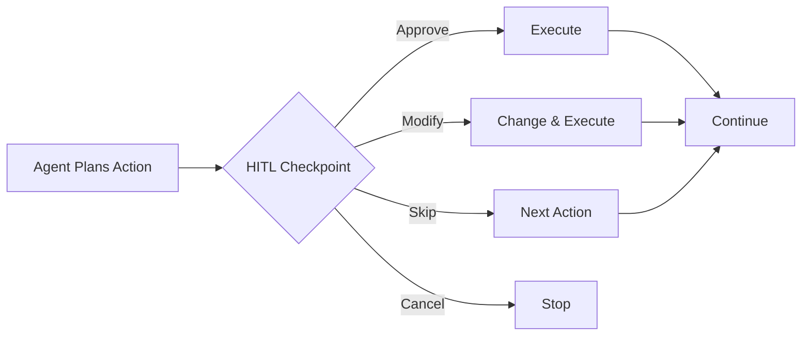

## What is HITL?

Human-in-the-Loop (HITL) means you stay in control during automation. The agent pauses before important actions, letting you approve, modify, or cancel.



## Why HITL?

<CardGroup cols={2}>
  <Card title="Safety" icon="shield-check">
    Prevent unintended actions
  </Card>
  <Card title="Accuracy" icon="bullseye">
    Correct mistakes before they happen
  </Card>
  <Card title="Learning" icon="graduation-cap">
    Understand how the agent thinks
  </Card>
  <Card title="Trust" icon="handshake">
    Build confidence in automation
  </Card>
</CardGroup>

## HITL Controls

When the agent pauses, you see:

### Approve

Let the action proceed as planned.

```
Agent: I'm about to click the "Submit" button
You: [Approve]
Agent: Clicked "Submit"
```

### Modify

Change what the agent will do.

```
Agent: I'm about to type "Q1 2023" in the date field
You: [Modify] Type "Q1 2024" instead
Agent: Typed "Q1 2024" in the date field
```

### Skip

Skip this action and continue to the next.

```
Agent: I'm about to click "Cookie Settings"
You: [Skip]
Agent: Skipped. Continuing...
```

### Cancel

Stop the entire execution immediately.

```
Agent: I'm about to delete the file
You: [Cancel]
Agent: Execution cancelled
```

## Sensitive Actions

HITL pauses on actions that could cause problems:

| Action Type | Why It's Sensitive |
|-------------|-------------------|
| **Clicking Submit/Delete** | May commit changes |
| **Typing sensitive data** | Passwords, personal info |
| **File operations** | Save, delete, rename |
| **Navigation** | Leaving current context |
| **System actions** | Shutdown, restart |

## Configuring HITL

### Process-Level Setting

In your process settings, choose:

| Mode | Behavior |
|------|----------|
| **All Actions** | Pause before every action |
| **Sensitive Only** | Pause only on risky actions |
| **None** | Run without pausing |

### Runtime Override

When starting a run, you can override:

- "Run with full HITL" - Override to all actions
- "Run unattended" - Override to no HITL

## Best Practices

<AccordionGroup>
  <Accordion title="Start with HITL on everything">
    Until you're confident the automation works correctly, keep full HITL enabled.
  </Accordion>

  <Accordion title="Gradually reduce oversight">
    Once a process runs reliably several times:
    1. Switch from "All Actions" to "Sensitive Only"
    2. After more success, consider "None" for low-risk tasks
  </Accordion>

  <Accordion title="Pay attention to modifications">
    If you frequently modify the same action, the process description may need updating.
  </Accordion>

  <Accordion title="Don't just click Approve blindly">
    Read what the agent plans to do. Blind approval defeats the purpose.
  </Accordion>
</AccordionGroup>

## Keyboard Shortcuts

Speed up HITL interaction:

| Shortcut | Action |
|----------|--------|
| `Enter` | Approve |
| `M` | Open modify dialog |
| `S` | Skip |
| `Escape` | Cancel |

## Modify Examples

Common modifications:

```
# Fix a typo
Agent: I'll type "recieve" in the message field
You: Type "receive" instead

# Change target
Agent: I'll click the "Save Draft" button
You: Click "Save and Send" instead

# Add a wait
Agent: I'll click the dropdown
You: Wait 2 seconds first, then click

# Change value
Agent: I'll enter "100" in the quantity field
You: Enter "150" instead
```

## Handling Errors

When the agent encounters an issue:

1. It pauses and describes the problem
2. Screenshot shows the current state
3. You can modify the approach or cancel

<Tip>
  If the agent repeatedly fails on the same action, consider modifying your process description to be more specific.
</Tip>

## Logging HITL Decisions

All HITL interactions are logged:

- What action was proposed
- Your decision (approve/modify/skip/cancel)
- Any modifications you made
- Timestamps

View these in the run details under "Timeline."

## Next Steps

<CardGroup cols={2}>
  <Card title="Live Video" icon="video" href="/agent-execution/live-video">
    See what's happening
  </Card>
  <Card title="Recordings" icon="circle-play" href="/agent-execution/recordings">
    Review past runs
  </Card>
</CardGroup>
