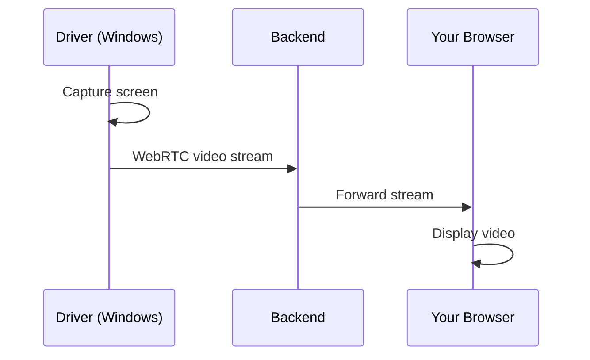

## Live Video Streaming

Granite streams the Windows desktop to your browser in real-time. See exactly what the agent sees.

## How It Works

**Technology:** WebRTC for low-latency, high-quality streaming.

## Video Panel Features

| Feature | Description |
|---------|-------------|
| **Live View** | Current desktop state |
| **Full Screen** | Expand for better visibility |
| **Screenshot** | Capture current frame |
| **Quality** | Automatic adjustment |

## Video Controls

<CardGroup cols={3}>
  <Card title="Full Screen" icon="expand">
    Click to maximize the video
  </Card>
  <Card title="Screenshot" icon="camera">
    Capture the current view
  </Card>
  <Card title="Refresh" icon="rotate">
    Reconnect if stream stalls
  </Card>
</CardGroup>

## What You'll See

During execution:

- **Desktop state** - Applications, windows, dialogs
- **Mouse movements** - Where the agent is clicking
- **Typing** - Text being entered
- **Navigation** - Window switches, scrolling

## Latency

Video has minimal delay:

| Connection | Typical Latency |
|------------|-----------------|
| Same region | 100-300ms |
| Cross-region | 300-500ms |

<Info>
  A slight delay is normal. HITL approvals aren't affected since execution pauses.
</Info>

## Quality Settings

Video quality adjusts automatically based on:

- Your internet speed
- Server load
- Network conditions

Higher quality = more bandwidth but clearer picture.

## Troubleshooting

<AccordionGroup>
  <Accordion title="Video not loading">
    - Check if WebRTC is allowed in your browser
    - Try refreshing the page
    - Disable VPN (may block WebRTC)
    - Try a different browser
  </Accordion>

  <Accordion title="Video is laggy/frozen">
    - Check your internet connection
    - Close other bandwidth-heavy applications
    - Try reducing video quality (if option available)
    - Refresh the stream
  </Accordion>

  <Accordion title="Black screen">
    - The driver may be initializing
    - Wait a few seconds
    - Check driver status in Driver Management
  </Accordion>

  <Accordion title="Audio not working">
    Audio is not streamed (video only). Agent actions don't produce meaningful audio.
  </Accordion>
</AccordionGroup>

## Browser Compatibility

| Browser | Support |
|---------|---------|
| Chrome | Full |
| Firefox | Full |
| Safari | Full |
| Edge | Full |

## Network Requirements

For reliable streaming:

- **Minimum:** 1 Mbps download
- **Recommended:** 5+ Mbps download
- **Firewall:** Allow WebRTC (UDP)

## Privacy

Video streams are:

- **Encrypted** - TLS in transit
- **Not stored** - Live only (recordings are separate)
- **Organization-scoped** - Only your team can view

## Tips

<AccordionGroup>
  <Accordion title="Use a large monitor">
    More screen space = easier to see details in the video.
  </Accordion>

  <Accordion title="Full screen for complex tasks">
    When the agent navigates complex UIs, full screen helps.
  </Accordion>

  <Accordion title="Don't rely solely on video">
    The chat panel provides text descriptions. Use both for full context.
  </Accordion>
</AccordionGroup>

## Next Steps

<CardGroup cols={2}>
  <Card title="HITL Workflows" icon="hand" href="/agent-execution/hitl-workflows">
    Control what happens
  </Card>
  <Card title="Recordings" icon="circle-play" href="/agent-execution/recordings">
    Review past sessions
  </Card>
</CardGroup>
