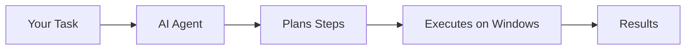

## What is Agent Execution?

Agent execution is how Granite runs your automations. An AI agent interprets your task, plans the steps, and executes them on a Windows machine.

## Key Features

<CardGroup cols={3}>
  <Card title="Human-in-the-Loop" icon="hand" href="/agent-execution/hitl-workflows">
    Approve actions before they execute
  </Card>
  <Card title="Screenshots" icon="camera">
    Automatic captures at each step
  </Card>
  <Card title="Recordings" icon="circle-play" href="/agent-execution/recordings">
    Full video recordings of sessions
  </Card>
</CardGroup>

## Execution Flow

<Steps>
  <Step title="Job Queued">
    When you run a process, a job enters the queue
  </Step>

  <Step title="Driver Assigned">
    An available driver machine claims the job
  </Step>

  <Step title="Connection Established">
    WebSocket connects dashboard to driver for real-time updates
  </Step>

  <Step title="Agent Starts">
    AI agent begins interpreting your task
  </Step>

  <Step title="Actions Execute">
    Each action:
    - Shown to you (with HITL)
    - Screenshot captured
    - Executed on desktop
    - Result verified
  </Step>

  <Step title="Completion">
    Task finishes, recording saved, results available
  </Step>
</Steps>

## Agent Capabilities

The agent can:

| Action | Examples |
|--------|----------|
| **Click** | Buttons, menus, links, icons |
| **Type** | Text fields, documents, search boxes |
| **Navigate** | Open apps, switch windows, scroll |
| **Read** | Extract text, verify content |
| **Wait** | For elements, for loading |
| **Decide** | Handle variations, recover from errors |

## Execution Modes

<Tabs>
  <Tab title="With HITL">
    **Human-in-the-Loop enabled (default)**

    - Agent pauses before sensitive actions
    - You approve, modify, or cancel
    - Maximum control and oversight
  </Tab>

  <Tab title="Without HITL">
    **Fully automated**

    - Agent runs without pausing
    - Faster execution
    - Use for trusted, tested automations
  </Tab>
</Tabs>

## Real-Time Monitoring

During execution, you see:

- **Live video** - The Windows desktop in real-time
- **Chat log** - Each action described
- **Progress** - Current stage indicator
- **Controls** - Pause, cancel buttons

## Error Handling

When something goes wrong:

1. Agent describes the error
2. Screenshot shows the state
3. You can:
   - Modify the approach
   - Skip the action
   - Cancel execution

## After Execution

Once complete, you have:

- **Execution summary** - Success/failure, duration
- **Screenshot gallery** - All captured images
- **Video recording** - Full session replay
- **Detailed logs** - Timestamped trace

## Best Practices

<AccordionGroup>
  <Accordion title="Start with HITL enabled">
    Until you're confident the automation works, keep HITL on.
  </Accordion>

  <Accordion title="Watch the video">
    Even successful runs may reveal optimization opportunities.
  </Accordion>

  <Accordion title="Use clear task descriptions">
    The clearer your description, the better the agent performs.
  </Accordion>

  <Accordion title="Test before going unattended">
    Run with HITL several times before disabling oversight.
  </Accordion>
</AccordionGroup>

## Next Steps

<CardGroup cols={2}>
  <Card title="HITL Workflows" icon="hand" href="/agent-execution/hitl-workflows">
    Master human oversight
  </Card>
  <Card title="Recordings" icon="circle-play" href="/agent-execution/recordings">
    Review past sessions
  </Card>
</CardGroup>
