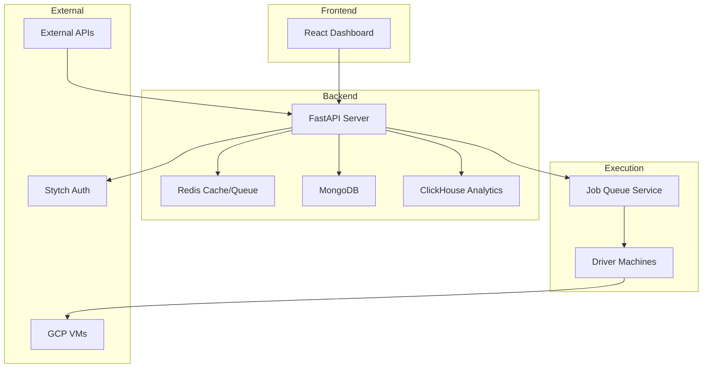
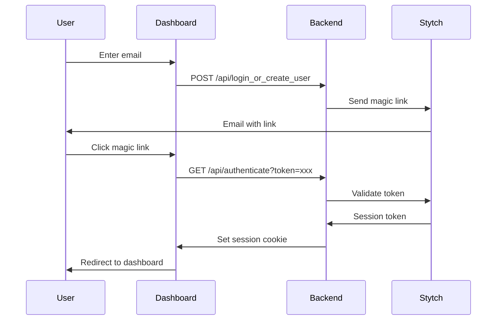

## System Overview

Granite is built as a distributed system with these core components:

## Components

<CardGroup cols={2}>
  <Card title="Dashboard" icon="browser">
    **React 19 + TypeScript + Vite**

    - Single-page application
    - Real-time WebSocket updates
    - WebRTC video streaming
    - Tailwind CSS + Radix UI
  </Card>

  <Card title="Backend API" icon="server">
    **FastAPI + Python 3.12**

    - 110+ REST endpoints
    - WebSocket connections
    - Server-Sent Events (SSE)
    - OpenAPI documentation
  </Card>

  <Card title="Database Layer" icon="database">
    **MongoDB + ClickHouse**

    - MongoDB for documents
    - ClickHouse for analytics
    - Redis for caching/queues
  </Card>

  <Card title="Driver System" icon="desktop">
    **Python + PyAutoGUI + Robocorp**

    - Windows desktop automation
    - Screen capture & recording
    - WebSocket job execution
  </Card>
</CardGroup>

## Data Flow

### Automation Execution Flow

<Steps>
  <Step title="User Creates Process">
    User defines a process in the dashboard with a prompt or RPA script
  </Step>
  <Step title="Job Queued">
    Backend creates a job and adds it to the Redis queue
  </Step>
  <Step title="Driver Picks Up Job">
    An available driver machine claims the job via WebSocket
  </Step>
  <Step title="Execution Begins">
    Driver executes the automation, streaming video back
  </Step>
  <Step title="HITL Checkpoints">
    Sensitive actions pause for user approval via WebSocket
  </Step>
  <Step title="Results Stored">
    Screenshots, recordings, and logs saved to MongoDB/GCS
  </Step>
  <Step title="Analytics Updated">
    Execution metrics written to ClickHouse
  </Step>
</Steps>

### Authentication Flow

## Key Technologies

| Component | Technology | Purpose |
|-----------|------------|---------|
| Frontend | React 19, TypeScript, Vite | Web interface |
| Backend | FastAPI, Uvicorn | API server |
| Auth | Stytch B2B | Magic link + OAuth |
| Primary DB | MongoDB | Document storage |
| Analytics DB | ClickHouse | Time-series metrics |
| Cache/Queue | Redis | Job queue, sessions |
| Driver | Python, PyAutoGUI, Robocorp | Desktop automation |
| Video | WebRTC, aiortc | Live streaming |
| Cloud | GCP (MIG, GCS) | VM management, storage |

## API Structure

The backend exposes 110+ endpoints organized into these groups:

<Tabs>
  <Tab title="Authentication">
    - `POST /api/login_or_create_user` - Send magic link
    - `GET /api/authenticate` - Complete auth
    - `POST /api/logout` - End session
    - `GET /api/me` - Current user info
  </Tab>

  <Tab title="Agent Execution">
    - `GET /api/agent/run` - Stream agent execution (SSE)
    - `GET /api/agent/runs` - List past runs
    - `POST /api/agent-runs/{id}/respond` - HITL response
    - `POST /api/agent-runs/{id}/cancel` - Cancel run
  </Tab>

  <Tab title="Organizations">
    - `POST /api/create_organization` - New org
    - `GET /api/organizations` - List orgs
    - `POST /api/organizations/{id}/members/invite` - Invite member
    - `PATCH /api/organizations/{id}/members/{id}/role` - Update role
  </Tab>

  <Tab title="Analytics">
    - `POST /api/analytics/batch` - All metrics at once
    - `GET /api/analytics/executions-over-time` - Time series
    - `GET /api/analytics/success-rate` - Success metrics
    - `GET /api/analytics/failure-breakdown` - Failure analysis
  </Tab>
</Tabs>

## Deployment Options

<CardGroup cols={2}>
  <Card title="Cloud (GCP)" icon="cloud">
    - Managed Instance Groups for VMs
    - Automatic scaling
    - Google Cloud Storage for assets
    - Production-ready setup
  </Card>

  <Card title="Local (Hyper-V)" icon="computer">
    - Windows 11 VMs on your machine
    - Great for development/testing
    - Full control over environment
    - See [Local Sandbox Setup](/vm-management/local-sandbox-setup)
  </Card>
</CardGroup>

## Security

<AccordionGroup>
  <Accordion title="Authentication" icon="lock">
    - Stytch B2B for enterprise-grade auth
    - Magic link + OAuth options
    - Session tokens in HTTP-only cookies
    - 7-day session expiration
  </Accordion>

  <Accordion title="Authorization" icon="shield">
    - Role-based access control (Admin/Member/Viewer)
    - Organization-scoped data isolation
    - API key authentication for public endpoints
  </Accordion>

  <Accordion title="API Security" icon="key">
    - `X-Granite-API-Key` header for public endpoints
    - Unkey for API key management
    - Rate limiting on sensitive endpoints
  </Accordion>
</AccordionGroup>

## Next Steps

<CardGroup cols={2}>
  <Card title="Get Started" icon="rocket" href="/quickstart">
    Run your first automation
  </Card>
  <Card title="API Reference" icon="code" href="/api-reference/overview">
    Explore all 110+ endpoints
  </Card>
</CardGroup>
