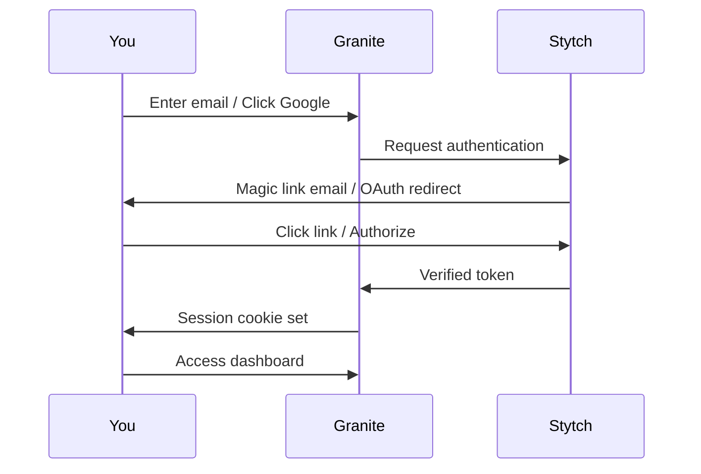

## Authentication Methods

Granite supports two authentication methods:

<CardGroup cols={2}>
  <Card title="Magic Link" icon="envelope">
    Passwordless email authentication
  </Card>
  <Card title="Google OAuth" icon="google">
    Sign in with your Google account
  </Card>
</CardGroup>

Both methods are powered by [Stytch](https://stytch.com/), an enterprise-grade authentication provider.

## How It Works



## Session Management

After authentication:

- **Session cookie** stored securely (HTTP-only)
- **Valid for 7 days** by default
- **Automatic refresh** on activity
- **Secure logout** clears the session

## Multi-Organization Support

One account can belong to multiple organizations:

- Same email, different orgs
- Switch between orgs instantly
- Separate permissions per org

## API Authentication

For programmatic access, use API keys instead of user sessions:

```bash
curl -X POST "https://api.getgranite.ai/api/your-org/endpoint" \
  -H "X-Granite-API-Key: gk_live_abc123..."
```

See [API Management](/dashboard/api-management) for details.

## Security Features

| Feature | Description |
|---------|-------------|
| **HTTP-only cookies** | Session tokens can't be accessed by JavaScript |
| **HTTPS only** | All traffic encrypted in transit |
| **Session expiration** | Automatic logout after inactivity |
| **Single logout** | Sign out from all devices |

## Next Steps

<CardGroup cols={2}>
  <Card title="Magic Link" icon="envelope" href="/authentication/magic-link">
    Passwordless email login
  </Card>
  <Card title="Google OAuth" icon="google" href="/authentication/oauth">
    Sign in with Google
  </Card>
  <Card title="Organizations" icon="building" href="/authentication/organizations">
    Multi-org management
  </Card>
</CardGroup>
