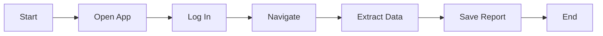

## What are Processes?

A **Process** is a reusable automation definition. You create it once, then run it whenever you need.

<Frame>
  
</Frame>

## Viewing Processes

The Processes page shows all your automations:

- **Search** - Find processes by name
- **Filter** - By status (draft, ready, archived)
- **Sort** - By name, date created, last run

## Creating a New Process

<Steps>
  <Step title="Click New Process">
    Hit the **+ New Process** button in the top right
  </Step>

  <Step title="Enter Details">
    | Field | Description | Example |
    |-------|-------------|---------|
    | **Name** | Short, descriptive title | "Weekly Sales Report" |
    | **Description** | What the automation does | "Open Excel, pull data from CRM, generate PDF report" |
  </Step>

  <Step title="Save">
    Click **Create** to save your process
  </Step>
</Steps>

## Process Details View

Click any process to see its details:

<Tabs>
  <Tab title="Overview">
    - Process name and description
    - Current status
    - Last execution info
    - Quick run button
  </Tab>

  <Tab title="Performance">
    - Execution history chart
    - Success/failure rates
    - Average duration
    - Recent runs list
  </Tab>

  <Tab title="Documentation">
    - Auto-generated docs
    - Parameters and inputs
    - Expected outputs
  </Tab>

  <Tab title="Settings">
    - Edit name/description
    - Configure HITL settings
    - Archive or delete
  </Tab>
</Tabs>

## Running a Process

From the process detail page:

1. Click the **Run** button
2. Fill in any required parameters
3. Choose HITL mode (if configurable)
4. Click **Start Execution**

You'll be taken to the [Agent Run](/dashboard/agent-run) page to watch the execution.

## Process Status

| Status | Meaning |
|--------|---------|
| **Draft** | Still being configured, not runnable |
| **Ready** | Can be executed |
| **Running** | Currently executing |
| **Archived** | No longer active, hidden by default |

## Workflow Visualization

Some processes show a visual workflow diagram:

This helps you understand the automation steps at a glance.

## Editing a Process

To modify an existing process:

1. Open the process detail page
2. Click **Edit** in the settings tab
3. Make your changes
4. Click **Save**

<Warning>
  Editing a process doesn't affect past executions. Only future runs use the updated configuration.
</Warning>

## Archiving vs. Deleting

| Action | What Happens |
|--------|--------------|
| **Archive** | Hides the process, keeps history, can be restored |
| **Delete** | Permanently removes the process and all its data |

<Tip>
  Archive processes you're not using anymore. Delete only when you're sure you won't need the data.
</Tip>

## Duplicating a Process

To create a copy:

1. Open the process
2. Click the **...** menu
3. Select **Duplicate**
4. Give it a new name

This is useful when you want a similar process with slight variations.

## Bulk Actions

Select multiple processes to:

- Archive them all
- Delete them all
- Export their configurations

## Tips for Good Processes

<AccordionGroup>
  <Accordion title="Use descriptive names">
    Bad: "Process 1"
    Good: "Daily CRM Data Export to Excel"
  </Accordion>

  <Accordion title="Write clear descriptions">
    Include:
    - What the automation does
    - What inputs it needs
    - What outputs it produces
  </Accordion>

  <Accordion title="Start simple">
    Build and test one step at a time. Don't try to automate everything at once.
  </Accordion>

  <Accordion title="Use parameters">
    Instead of hardcoding values, use parameters so you can reuse the process with different inputs.
  </Accordion>
</AccordionGroup>

## Next Steps

<CardGroup cols={2}>
  <Card title="Run an Agent" icon="play" href="/dashboard/agent-run">
    Execute your process
  </Card>
  <Card title="Create RPA Scripts" icon="code" href="/rpa-automation/overview">
    Build reliable automations
  </Card>
</CardGroup>
