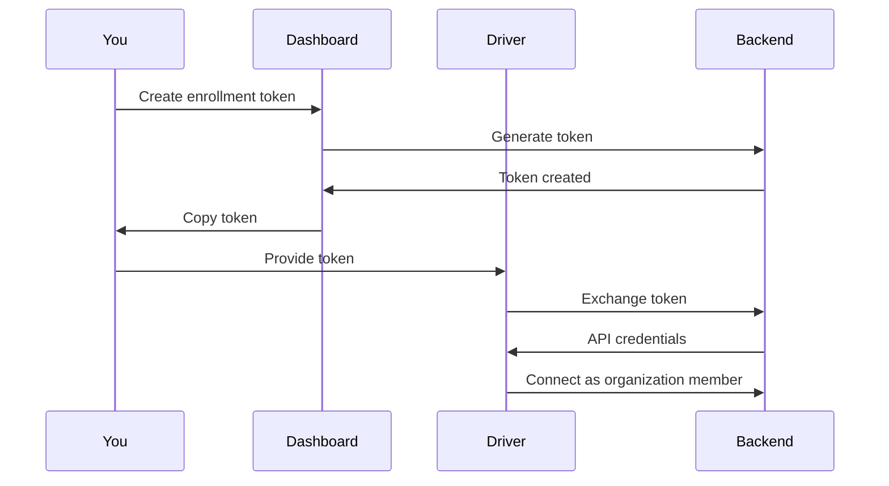

## What is Enrollment?

Enrollment connects your driver machine to your Granite organization. The driver exchanges a one-time token for permanent credentials.



## Creating an Enrollment Token

<Steps>
  <Step title="Go to API Management">
    Navigate to **API Management** in the dashboard
  </Step>

  <Step title="Create Token">
    In the Enrollment Tokens section, click **+ Create Token**
  </Step>

  <Step title="Copy Token">
    A token is generated:

    ```
    enroll_x7y8z9a1b2c3d4e5f6g7h8...
    ```

    Copy it immediately.
  </Step>
</Steps>

<Warning>
  Tokens expire after 24 hours and can only be used once.
</Warning>

## Using the Token

On your driver machine:

<Tabs>
  <Tab title="Interactive">
    ```powershell
    python main.py --enroll
    ```

    When prompted, paste your token:

    ```
    Enter enrollment token: enroll_x7y8z9a1b2c3d4e5f6g7h8...
    Enrolling with organization...
    ✓ Enrollment successful!
    ✓ Credentials saved to .granite/credentials
    ✓ Starting driver...
    ```
  </Tab>

  <Tab title="Command Line">
    ```powershell
    python main.py --enroll --token "enroll_x7y8z9a1b2c3d4e5f6g7h8..."
    ```
  </Tab>

  <Tab title="Environment Variable">
    ```powershell
    $env:GRANITE_ENROLL_TOKEN = "enroll_x7y8z9a1b2c3d4e5f6g7h8..."
    python main.py --enroll
    ```
  </Tab>
</Tabs>

## What Happens During Enrollment

1. **Token validation** - Backend verifies the token is valid and unused
2. **Credential generation** - Backend creates permanent API credentials
3. **Credentials stored** - Driver saves credentials locally
4. **Token consumed** - Token can't be reused
5. **Connection established** - Driver connects to your organization

## Verifying Enrollment

After successful enrollment:

1. Go to **Driver Management** in the dashboard
2. Your machine should appear in the list
3. Status should be **Online** (green)

## Re-enrolling

If you need to re-enroll (new credentials, different org):

1. Delete stored credentials:
   ```powershell
   Remove-Item -Path ".granite/credentials" -Force
   ```
2. Create a new enrollment token
3. Run enrollment again

## Multiple Organizations

A single driver can only belong to one organization. To use with a different org:

1. Stop the driver
2. Delete credentials
3. Enroll with the new organization's token

## Security

Enrollment tokens are:

- **One-time use** - Consumed on successful enrollment
- **Time-limited** - Expire after 24 hours
- **Organization-scoped** - Link driver to specific org
- **Revocable** - Can be revoked before use

## Troubleshooting

<AccordionGroup>
  <Accordion title="Token invalid or expired">
    - Check the token wasn't already used
    - Create a new token if expired
    - Make sure you copied the full token
  </Accordion>

  <Accordion title="Network error during enrollment">
    - Check internet connectivity
    - Verify firewall allows HTTPS to api.getgranite.ai
    - Try again
  </Accordion>

  <Accordion title="Driver shows offline after enrollment">
    - Check the driver is still running
    - Verify WebSocket connection in logs
    - See [Troubleshooting](/driver/troubleshooting)
  </Accordion>
</AccordionGroup>

## Next Steps

<CardGroup cols={2}>
  <Card title="Driver Management" icon="server" href="/dashboard/driver-management">
    Monitor your machines
  </Card>
  <Card title="Troubleshooting" icon="wrench" href="/driver/troubleshooting">
    Fix issues
  </Card>
</CardGroup>
