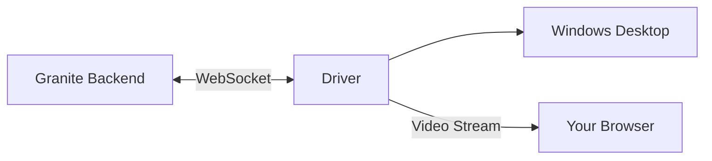
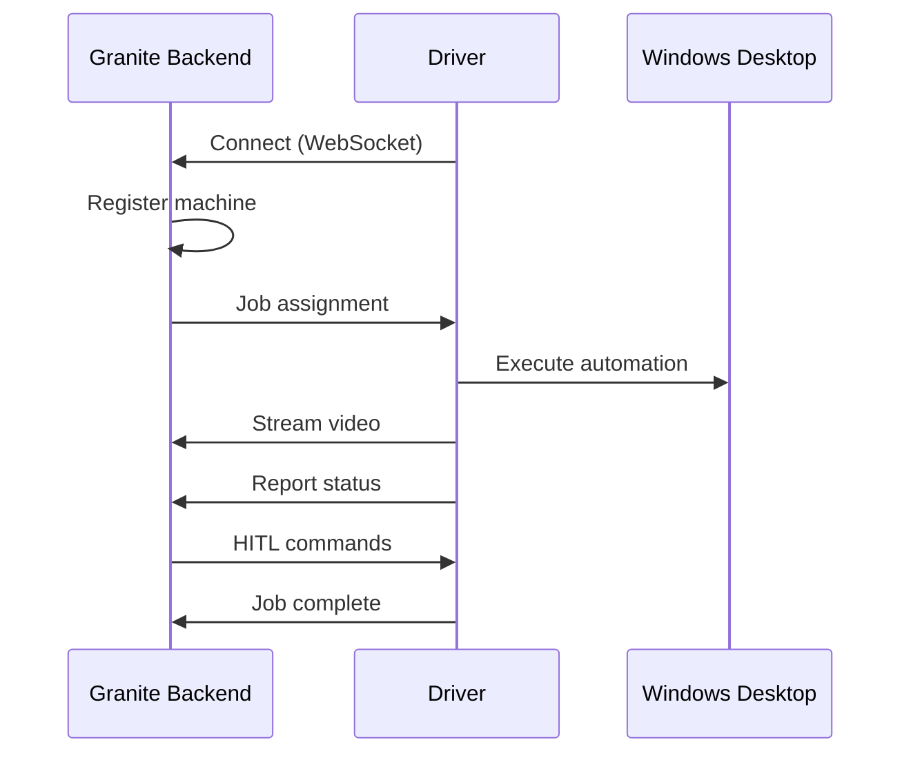

## What is the Driver?

The Granite driver is software that runs on Windows machines to execute automations. It:

- Connects to Granite's backend via WebSocket
- Receives job assignments
- Executes desktop automation
- Streams video back to your browser
- Reports results

## Driver Capabilities

| Capability | Description |
|------------|-------------|
| **UI Automation** | Click, type, navigate |
| **Screen Capture** | Screenshots and video |
| **Video Streaming** | Real-time WebRTC |
| **Job Queue** | Accept and process jobs |
| **Heartbeat** | Connection monitoring |

## Driver Types

<CardGroup cols={2}>
  <Card title="Cloud (GCP)" icon="cloud">
    Managed VMs in Google Cloud

    - Auto-provisioned
    - Auto-scaling
    - Pay-per-use
    - Zero maintenance
  </Card>

  <Card title="Local (Self-Hosted)" icon="server">
    Your own Windows machines

    - Full control
    - Your infrastructure
    - Free (your hardware)
    - You manage maintenance
  </Card>
</CardGroup>

## Requirements

To run the Granite driver:

| Requirement | Specification |
|-------------|---------------|
| **OS** | Windows 10/11 (Pro or Enterprise) |
| **Python** | 3.12 (not 3.13+) |
| **RAM** | 4GB minimum |
| **Network** | HTTPS access to api.getgranite.ai |
| **Admin** | Administrator privileges |

<Warning>
  Python 3.13+ is not supported due to pywin32 compatibility issues. Use Python 3.12.
</Warning>

## Architecture

## Driver States

| State | Description |
|-------|-------------|
| **Offline** | Not connected |
| **Online** | Connected, waiting for jobs |
| **Busy** | Currently executing a job |
| **Error** | Connection or execution issue |

## Next Steps

<CardGroup cols={2}>
  <Card title="Installation" icon="download" href="/driver/installation">
    Set up the driver
  </Card>
  <Card title="Enrollment" icon="user-plus" href="/driver/enrollment">
    Register your machine
  </Card>
  <Card title="Troubleshooting" icon="wrench" href="/driver/troubleshooting">
    Fix common issues
  </Card>
</CardGroup>
