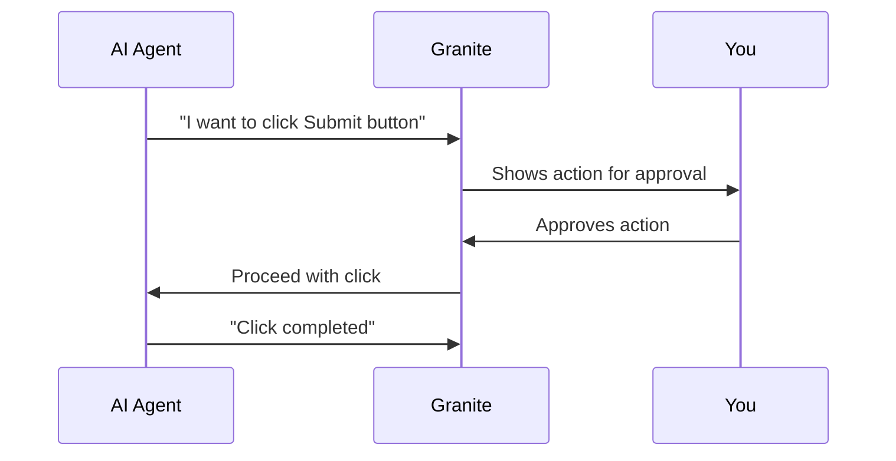
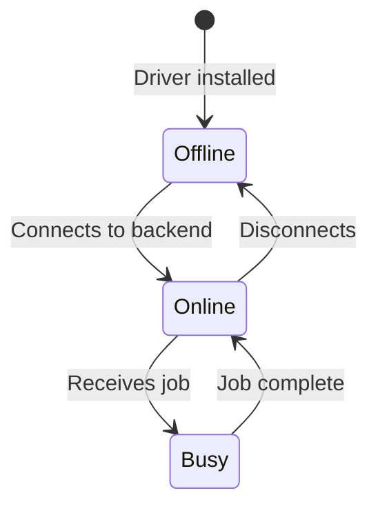

## Overview

Before diving deeper into Granite, it helps to understand these key concepts:

<CardGroup cols={2}>
  <Card title="HITL" icon="hand">
    Human-in-the-Loop - You approve actions as they happen
  </Card>
  <Card title="RPA" icon="robot">
    Robotic Process Automation - Scripted desktop automation
  </Card>
  <Card title="Processes" icon="gear">
    Reusable automation definitions
  </Card>
  <Card title="Drivers" icon="desktop">
    Windows machines that run automations
  </Card>
</CardGroup>

---

## Human-in-the-Loop (HITL)

HITL is Granite's core differentiator. Instead of blindly trusting automation, you stay in control.

### How It Works



### HITL Actions

| Action | When to Use |
|--------|-------------|
| **Approve** | The action looks correct |
| **Modify** | The action is close but needs adjustment |
| **Skip** | Skip this step, continue with the next |
| **Cancel** | Stop the entire execution |

### HITL Sensitivity

You can configure which actions require approval:

- **All actions** - Maximum oversight, approve everything
- **Sensitive only** - Approve clicks, file operations, etc.
- **None** - Full automation, no pauses (use with caution)

<Warning>
  Disabling HITL means the agent will execute without asking. Only do this for well-tested, low-risk automations.
</Warning>

---

## Processes

A **Process** is a reusable automation definition. Think of it as a template.

### Process Components

```yaml
Process:
  - Name: "Generate Sales Report"
  - Description: "Open Excel, load template, update data, save as PDF"
  - Type: AI Agent or RPA Script
  - Parameters: (optional inputs like date, filename)
```

### Process vs. Agent Run

| Term | Meaning |
|------|---------|
| **Process** | The definition (what to do) |
| **Agent Run** | A single execution (doing it once) |

You create a Process once, then run it many times.

### Process States

- **Draft** - Being edited, not ready to run
- **Ready** - Can be executed
- **Archived** - No longer active

---

## RPA (Robotic Process Automation)

RPA is scripted automation where you define exact steps in code.

### Why Use RPA?

- **Repeatability** - Same steps every time
- **Reliability** - Less AI interpretation, more control
- **Speed** - No AI decision-making overhead

### RPA in Granite

Granite uses [Robocorp](https://robocorp.com/) under the hood:

```python
from robocorp.tasks import task
from robocorp import browser

@task
def generate_report():
    browser.goto("https://app.example.com")
    browser.fill("input#username", "admin")
    browser.click("button#login")
    # ... more steps
```

### When to Use RPA vs. AI Agent

| Use Case | Recommendation |
|----------|----------------|
| Well-defined, repeatable tasks | RPA Script |
| Variable or exploratory tasks | AI Agent |
| High-volume, unattended | RPA Script |
| One-off or ad-hoc tasks | AI Agent |

<Tip>
  Start with AI Agent to figure out the steps, then convert to RPA Script for production use.
</Tip>

---

## Drivers

A **Driver** is a Windows machine that executes automations.

### Driver Types

<Tabs>
  <Tab title="Cloud (GCP)">
    - Managed by Granite
    - Auto-scaling
    - Pay-per-use
    - Ideal for production
  </Tab>

  <Tab title="Local (Hyper-V)">
    - Run on your own hardware
    - Full control
    - Free (your infrastructure)
    - Ideal for development
  </Tab>
</Tabs>

### Driver Lifecycle



### Driver Requirements

- Windows 10/11 (Pro or Enterprise)
- Python 3.12 (not 3.13+)
- Network access to Granite API
- RDP enabled (for remote management)

---

## Organizations

An **Organization** is a workspace for your team.

### Organization Features

- **Isolated data** - Your processes, runs, and keys are private
- **Team access** - Invite members with role-based permissions
- **API namespace** - Unique slug for your endpoints

### Roles

| Role | Create Processes | Run Automations | Manage Members | API Keys |
|------|-----------------|-----------------|----------------|----------|
| Admin | Yes | Yes | Yes | Yes |
| Member | Yes | Yes | No | No |
| Viewer | No | View only | No | No |

---

## API Endpoints

You can expose any automation as a public API endpoint.

### How It Works

1. Create a Process
2. Generate an API Endpoint for it
3. Get an API Key
4. Call it from anywhere

```bash
curl -X POST "https://api.getgranite.ai/api/your-org/run-report" \
  -H "X-Granite-API-Key: your-key" \
  -H "Content-Type: application/json" \
  -d '{"date": "2024-01-15"}'
```

### Authentication

API endpoints require an API Key in the `X-Granite-API-Key` header.

<Warning>
  **Keep your API keys secret.** They grant full access to run automations on your behalf.
</Warning>

---

## Analytics

Granite tracks everything about your automations:

### Metrics Available

- **Executions over time** - Volume trends
- **Success rate** - How often things work
- **Failure breakdown** - What goes wrong
- **Duration distribution** - How long things take
- **Top automations** - Most-used processes
- **Endpoint usage** - API call volume

### Dashboard Widgets

You can customize which metrics appear on your analytics dashboard.

---

## Glossary

| Term | Definition |
|------|------------|
| **Agent** | The AI that interprets tasks and executes actions |
| **Agent Run** | A single execution of a process |
| **Driver** | Windows machine running automations |
| **Endpoint** | Public API trigger for an automation |
| **HITL** | Human-in-the-Loop approval workflow |
| **MIG** | Managed Instance Group (GCP VMs) |
| **Process** | Reusable automation definition |
| **RPA** | Robotic Process Automation |
| **Stytch** | Authentication provider (magic links + OAuth) |

---

## Next Steps

<CardGroup cols={2}>
  <Card title="Dashboard Overview" icon="gauge" href="/dashboard/overview">
    Learn the interface
  </Card>
  <Card title="HITL Workflows" icon="hand" href="/agent-execution/hitl-workflows">
    Master human oversight
  </Card>
  <Card title="RPA Scripts" icon="code" href="/rpa-automation/overview">
    Create reliable automations
  </Card>
  <Card title="API Reference" icon="book" href="/api-reference/overview">
    Explore all endpoints
  </Card>
</CardGroup>
