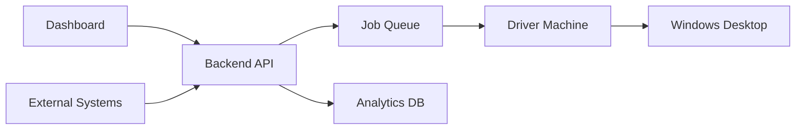

## What is Granite?

Granite is a **desktop automation platform** that combines AI agents with human oversight. You can:

- **Automate repetitive tasks** on Windows desktops
- **Watch AI execute** in real-time with live video streaming
- **Approve or modify actions** before they happen (HITL)
- **Trigger automations** via API from external systems
- **Track everything** with comprehensive analytics

<CardGroup cols={2}>
  <Card title="Quickstart" icon="rocket" href="/quickstart">
    Get your first automation running in 5 minutes
  </Card>
  <Card title="Dashboard Guide" icon="gauge" href="/dashboard/overview">
    Learn the Granite dashboard interface
  </Card>
  <Card title="API Reference" icon="code" href="/api-reference/overview">
    Integrate Granite with your systems
  </Card>
  <Card title="TypeScript SDK" icon="js" href="/typescript-sdk/overview">
    Use our official SDK for Node.js
  </Card>
</CardGroup>

## Key Features

<AccordionGroup>
  <Accordion title="Human-in-the-Loop (HITL)" icon="hand">
    Don't just fire-and-forget. Watch your AI agent work in real-time and approve sensitive actions before they execute. You stay in control.
  </Accordion>

  <Accordion title="RPA Automation" icon="robot">
    Built on Robocorp's proven RPA framework. Create reliable, repeatable desktop automations with Python scripts.
  </Accordion>

  <Accordion title="Live Video Streaming" icon="video">
    WebRTC-powered live video lets you see exactly what your agent sees. No guessing, no surprises.
  </Accordion>

  <Accordion title="Public API Endpoints" icon="globe">
    Expose your automations as REST endpoints. Trigger them from webhooks, cron jobs, or any external system.
  </Accordion>

  <Accordion title="Multi-Organization" icon="building">
    Invite team members, manage roles, and keep your automations organized across multiple organizations.
  </Accordion>

  <Accordion title="Comprehensive Analytics" icon="chart-line">
    Track execution metrics, success rates, failure breakdowns, and more with customizable dashboards.
  </Accordion>
</AccordionGroup>

## How It Works

<Steps>
  <Step title="Create a Process">
    Describe what you want to automate in plain English or create an RPA script
  </Step>
  <Step title="Connect a Driver">
    Install the Granite driver on a Windows machine (cloud VM or local)
  </Step>
  <Step title="Run with Oversight">
    Execute your automation with live video and HITL controls
  </Step>
  <Step title="Integrate and Scale">
    Expose as an API endpoint and trigger from external systems
  </Step>
</Steps>

## Architecture Overview

- **Dashboard**: React-based web interface
- **Backend API**: FastAPI with 110+ endpoints
- **Job Queue**: Redis-based job distribution
- **Driver**: Windows agent for desktop automation
- **Analytics**: ClickHouse for metrics and insights

## Next Steps

<CardGroup cols={3}>
  <Card title="Sign Up" icon="user-plus" href="/getting-started/sign-up">
    Create your free account
  </Card>
  <Card title="First Automation" icon="play" href="/getting-started/your-first-automation">
    Build something in 5 minutes
  </Card>
  <Card title="Key Concepts" icon="book" href="/getting-started/concepts">
    Understand HITL, RPA, and more
  </Card>
</CardGroup>
