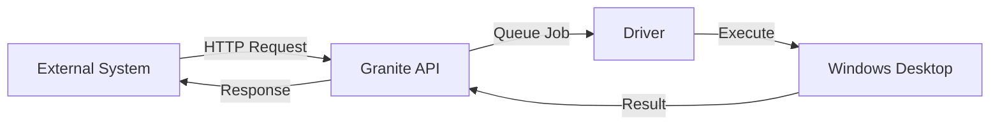

## What is the Public API?

The Public API lets you trigger Granite automations from anywhere:

- Webhooks from other services
- Cron jobs and schedulers
- CI/CD pipelines
- Custom applications
- Integrations

## How It Works



## Quick Example

```bash
curl -X POST "https://api.getgranite.ai/api/your-org/generate-report" \
  -H "X-Granite-API-Key: gk_live_abc123..." \
  -H "Content-Type: application/json" \
  -d '{"month": "January", "year": 2024}'
```

## Key Concepts

<CardGroup cols={2}>
  <Card title="Endpoints" icon="route" href="/public-api/creating-endpoints">
    Custom URLs for your automations
  </Card>
  <Card title="API Keys" icon="key" href="/public-api/api-keys">
    Authentication credentials
  </Card>
  <Card title="Invocation" icon="bolt" href="/public-api/invoking-automations">
    How to call your endpoints
  </Card>
</CardGroup>

## URL Structure

```
https://api.getgranite.ai/api/{org-slug}/{endpoint-slug}
```

| Part | Example | Description |
|------|---------|-------------|
| `org-slug` | `acme-corp` | Your organization's slug |
| `endpoint-slug` | `generate-report` | The endpoint you created |

## Authentication

All API requests require an API key:

```bash
-H "X-Granite-API-Key: gk_live_abc123..."
```

<Warning>
  Keep API keys secret. Never expose them in client-side code.
</Warning>

## Response Modes

<Tabs>
  <Tab title="Asynchronous">
    Default behavior - returns immediately with a run ID:

    ```json
    {
      "runId": "run_abc123",
      "status": "queued"
    }
    ```

    Poll for status later.
  </Tab>

  <Tab title="Synchronous">
    Add `?wait=true` to wait for completion:

    ```json
    {
      "runId": "run_abc123",
      "status": "completed",
      "duration": 45000,
      "result": { ... }
    }
    ```
  </Tab>
</Tabs>

## Common Use Cases

| Use Case | Example |
|----------|---------|
| **Scheduled reports** | Cron triggers daily report generation |
| **Webhook handling** | Process incoming data from another service |
| **CI/CD integration** | Run tests or deployments |
| **Form processing** | Handle submitted data |
| **Data sync** | Keep systems in sync |

## Rate Limits

| Plan | Limit |
|------|-------|
| Free | 100 requests/hour |
| Pro | 1,000 requests/hour |
| Enterprise | Custom |

## Security Best Practices

<AccordionGroup>
  <Accordion title="Use HTTPS only">
    All Granite API endpoints use HTTPS. Never downgrade.
  </Accordion>

  <Accordion title="Rotate keys periodically">
    Create new keys and deprecate old ones every 90 days.
  </Accordion>

  <Accordion title="Use separate keys per integration">
    If one is compromised, only that integration is affected.
  </Accordion>

  <Accordion title="Monitor usage">
    Check Analytics for unexpected patterns.
  </Accordion>
</AccordionGroup>

## Next Steps

<CardGroup cols={2}>
  <Card title="Create Endpoints" icon="plus" href="/public-api/creating-endpoints">
    Set up your first endpoint
  </Card>
  <Card title="API Keys" icon="key" href="/public-api/api-keys">
    Generate and manage keys
  </Card>
</CardGroup>
