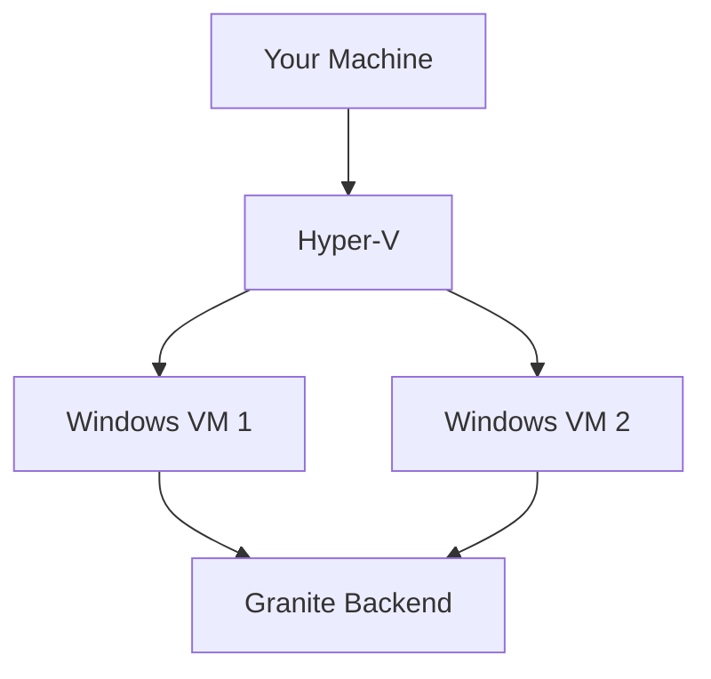
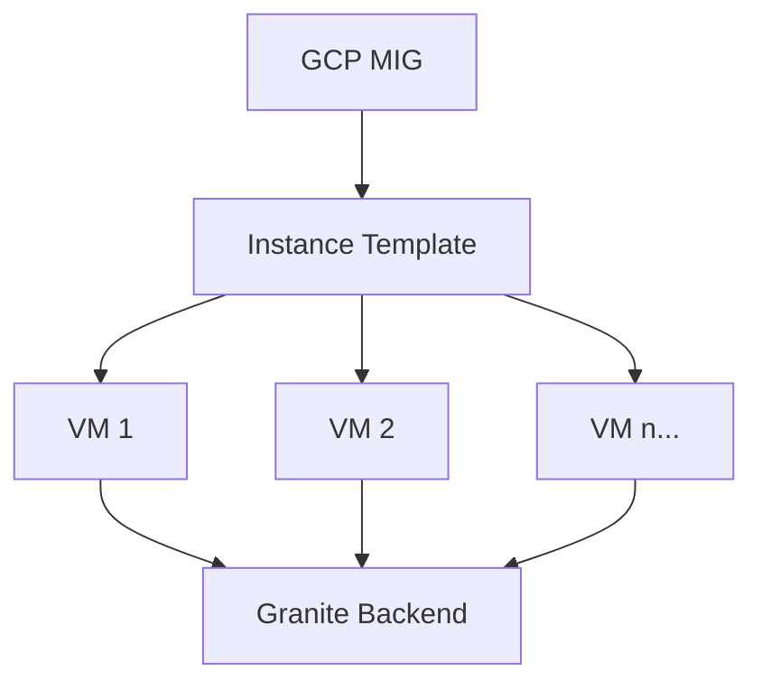

## VM Options

Granite supports two ways to run automation drivers:

<CardGroup cols={2}>
  <Card title="Local VMs (Hyper-V)" icon="computer" href="/vm-management/local-sandbox-setup">
    Run on your own Windows machines

    - Full control
    - No cloud costs
    - Great for development
  </Card>

  <Card title="Cloud VMs (GCP)" icon="cloud" href="/vm-management/gcp-mig">
    Managed VMs in Google Cloud

    - Zero maintenance
    - Auto-scaling
    - Production ready
  </Card>
</CardGroup>

## When to Use What

| Scenario | Recommendation |
|----------|----------------|
| Development & testing | Local VMs |
| Production workloads | Cloud VMs |
| Cost-sensitive | Local VMs |
| Scale-sensitive | Cloud VMs |
| Compliance requirements | Depends on policy |

## Architecture

### Local Setup

### Cloud Setup

## Key Concepts

| Term | Description |
|------|-------------|
| **Driver** | Software that runs automations |
| **VM** | Virtual machine hosting the driver |
| **MIG** | Managed Instance Group (GCP) |
| **Installation VM** | Temporary VM for setup |

## Machine Types

Available configurations:

| Type | vCPUs | RAM | Use Case |
|------|-------|-----|----------|
| Small | 2 | 4GB | Simple tasks |
| Medium | 4 | 8GB | Most automations |
| Heavy | 8 | 16GB | Complex workloads |

## Next Steps

<CardGroup cols={2}>
  <Card title="Local Setup" icon="computer" href="/vm-management/local-sandbox-setup">
    Set up Hyper-V VMs
  </Card>
  <Card title="GCP Setup" icon="cloud" href="/vm-management/gcp-mig">
    Configure cloud VMs
  </Card>
</CardGroup>
